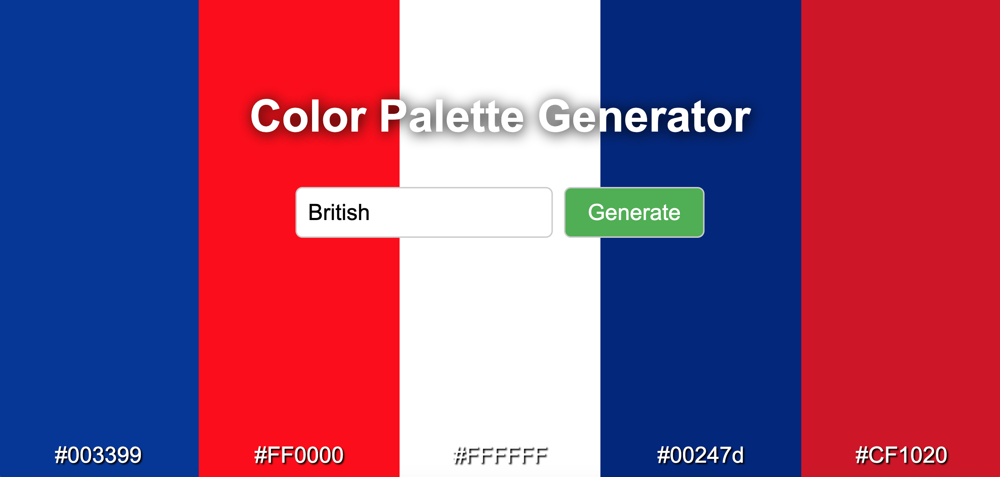
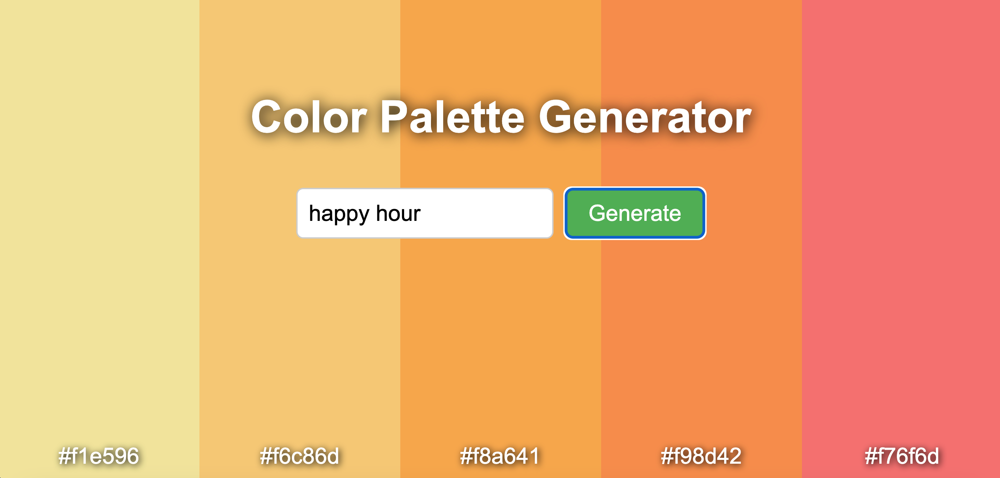

# Color Palette Generator

Simple Flask project using OpenAI's ChatGPT 3.5-turbo LLM to generate colour palettes as responses to user input.

---

## How to run this project?

1. Make sure you have Python installed.

2. Clone the project.

3. Create a virtual environment inside the project folder:

    `python -m venv venv`

4. Activate the virtual environment:

    Mac: `venv/bin/activate`

    Windows: `venv\Scripts\activate`

5. Install the python dependencies:

    `pip install -r requirements.txt`

6. Run the project:

    `flask run`

## Credit

This project was adopted from Colt Steele's Walkthrough project on Udemy: [Mastering OpenAI Python APIs](https://www.udemy.com/course/mastering-openai/?couponCode=24T3MT53024).

Changes made: The outdated APIs have been replaced as well as the frontend code has been improved.